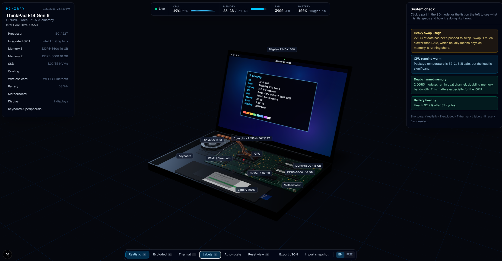

<div align="center">

[](https://github.com/kerwin2046/pc-xray/)

# PC·XRAY

**透视你的电脑。**

读取本机真实硬件信息，渲染成可交互的 3D 透视模型 —— 每一个 CPU 核心、每一条内存、
固态硬盘、热管、电池单元。点击任意部件，就能知道它是什么、规格如何、此刻在做什么。

[](https://github.com/kerwin2046/pc-xray/actions/workflows/ci.yml)
[](LICENSE)
[](https://nextjs.org)
[](https://www.typescriptlang.org)

[English](README.md) · 简体中文

</div>

---

## 这是什么

大多数硬件工具给你一张数字表格，PC·XRAY 直接把这台机器给你。

它读取的是同一批数据 —— 来自 sysfs 的 CPU 拓扑、直接从 SPD EEPROM 解码的 DDR5
参数、来自 hwmon 的温度 —— 然后据此构建出一个按物理结构排布的 3D 模型。十六个
核心就是芯片上的十六个核心，按大小核分类排布；两条内存就是插槽里的两条，每条上
的 DRAM 颗粒数量也和实际一致；风扇按你风扇真实的转速旋转。

然后它会讲解自己。点击 CPU，你会看到一段通俗说明：为什么会有性能核和能效核、
此刻哪些核心在忙。点击内存，双通道带宽的计算过程摆在那里。点击电池，你会看到
它相对设计容量的真实健康度。

整个程序完全在你自己的机器上运行，只监听回环地址，绝不向外发送任何数据。

[](https://github.com/kerwin2046/pc-xray/)

## 核心特性

**真实数据，不是示意图。** 核心数量、核心类型、缓存容量、颗粒密度、硬盘固件版本、
电池循环次数 —— 全部读自硬件。必须估算的数值会明确标注为估算值。

**实时遥测。** 每 2 秒刷新：每核负载与频率、每核温度、内存压力、风扇转速、电池
状态。核心亮度跟随负载变化，风扇按实测转速旋转。

**两种视觉风格。** 简洁的示意风格，以及真实风格（`V`）—— PBR 材质、程序化生成的
PCB 丝印、内存金手指与颗粒丝印，以及用你真实硬件字符串印制的 SSD、电池、无线网卡
贴纸。

**爆炸视图**（`E`）拆开各层结构，并把 SoC 分离为计算模块、核显与 I/O 模块。

**温度视图**（`T`）按实时温度为每个部件重新着色。

**通俗讲解**由你的数据生成，而非套用模板：大小核分工、通道带宽、电池损耗、
散热余量。

**整机诊断。** 内存压力、交换空间占用、CPU 温度、单通道与双通道、电池老化、
磁盘容量。

**硬件快照。** 把本机导出为 JSON，也可以导入别人的快照来查看。快照中不含序列号、
MAC 地址、IP 地址和 UUID。

**中英双语。** 默认英文，一键切换中文，即时生效无需刷新。

## 快速开始

**环境要求：** Node.js >= 22.13、pnpm 11、支持 WebGL2 的浏览器。

```bash
git clone https://github.com/kerwin2046/pc-xray.git
cd pc-xray
corepack enable
pnpm install
pnpm dev
```

打开 <http://127.0.0.1:3000>。

开发服务器和生产服务器都只监听 `127.0.0.1`，硬件信息不会暴露到局域网。

## 使用说明

### 快捷键

| 按键  | 功能               |
| ----- | ------------------ |
| `V`   | 切换真实材质       |
| `E`   | 切换爆炸视图       |
| `T`   | 切换温度视图       |
| `L`   | 切换标签           |
| `R`   | 重置视角并取消选择 |
| `Esc` | 取消选择           |

拖拽旋转视角，滚轮缩放，点击部件选中。

### 深链接

每一种视图状态都可以用 URL 表达，方便把你想说的那一处直接分享给别人：

```
/?part=cpu&exploded=1&heat=1&labels=0&style=real&lang=zh
```

| 参数       | 取值                                                                            | 默认值               |
| ---------- | ------------------------------------------------------------------------------- | -------------------- |
| `part`     | `board` `cpu` `gpu` `ram-0` `ssd-0` `battery` `cooling` `wifi` `display` `input` | 不选中               |
| `exploded` | `1`                                                                             | 关闭                 |
| `heat`     | `1`                                                                             | 关闭                 |
| `labels`   | `0` 表示隐藏                                                                    | 显示                 |
| `style`    | `real`                                                                          | 示意风格             |
| `lang`     | `en` `zh`                                                                       | 读 cookie，否则 `en` |

`lang` 的优先级高于保存在 `pcx-locale` cookie 中的选择。

### 硬件快照

```bash
pnpm snapshot                 # 写入 snapshot.json
pnpm snapshot my-laptop.json  # 或指定路径
```

也可以从工具栏直接导出。导入快照后即可用完整 3D 视图查看别人的硬件；期间实时轮询
会自动关闭，工具栏会显示当前查看的是哪份快照。

## HTTP 接口

两个接口都是本地的、无鉴权的，返回 JSON。

| 接口           | 说明                      | 缓存             |
| -------------- | ------------------------- | ---------------- |
| `/api/machine` | 静态信息（`MachineInfo`） | 服务端缓存 60 秒 |
| `/api/live`    | 实时采样（`LiveStats`）   | `no-store`       |

返回结构定义在 [`src/types/hardware.ts`](src/types/hardware.ts)。

## 硬件读取方式

`systeminformation` 提供跨平台基础能力。在 Linux 上，PC·XRAY 读得更深 —— 全部来自
全局可读路径，**无需 root**：

- **CPU 拓扑**读取 `/sys/devices/cpu_core` 与 `/sys/devices/cpu_atom`，据此区分
  P 核、E 核、LP-E 核并映射到逻辑 CPU。
- **内存细节**从 `spd5118` 驱动暴露的 SPD EEPROM 解码：DDR 代次、速率等级、
  颗粒密度、每条的位宽。
- **传感器**来自 `hwmon`：每核温度与封装温度、SSD 与无线网卡温度、风扇转速。

## 平台支持

| 平台    | 状态             | 说明                                   |
| ------- | ---------------- | -------------------------------------- |
| Linux   | 完整支持         | 核心分类、SPD 内存细节、完整传感器覆盖 |
| macOS   | 可运行，功能降级 | 无核心分类、无 SPD 数据、传感器有限    |
| Windows | 可运行，功能降级 | 无核心分类、无 SPD 数据、传感器有限    |

在非 Linux 平台上，界面会如实降级：缺失的数值显示为不可用而不是猜测，估算值会
明确标注。

3D 布局是笔记本通用结构的示意排布。**部件数量和规格参数是真实的，物理位置是示意的**，
并非你这台机器的精确还原。

## 隐私

标识性数据在采集环节就被排除，而不是事后剥离。采集器向 `systeminformation`
请求的是一份明确的字段清单，序列号、MAC 地址、IP 地址和硬件 UUID 从不在其中。
虚拟网卡和容器网卡按名称过滤掉。

快照中**确实包含**的内容：操作系统主机名、发行版、内核版本、硬盘型号名称。公开
分享前请先过目一遍。

所有数据都不会外发。没有遥测，没有分析统计，没有任何对外请求。

## 命令

| 命令             | 说明                            |
| ---------------- | ------------------------------- |
| `pnpm dev`       | 开发服务器，`127.0.0.1:3000`    |
| `pnpm build`     | 生产构建                        |
| `pnpm start`     | 以生产模式在 `127.0.0.1` 上运行 |
| `pnpm typecheck` | `tsc --noEmit`                  |
| `pnpm lint`      | ESLint                          |
| `pnpm snapshot`  | 导出硬件快照到 JSON             |

## 技术栈

Next.js 16（App Router、React Server Components）· React 19 · TypeScript 5
严格模式 · 基于 three.js 的 React Three Fiber 9 与 drei 10 · Tailwind CSS 4 ·
`systeminformation` 加自研 Linux sysfs 采集器。

## 项目结构

```
src/
├── app/          路由层：页面与 API 路由（刻意保持轻薄）
├── features/     功能模块 —— 目前只有 xray 一个
├── server/       仅服务端的硬件采集器，绝不打包进浏览器
├── lib/          纯领域逻辑与格式化
├── i18n/         语言配置与全部用户可见文案
└── types/        共享类型定义，被所有层引用
```

依赖只能自上而下流动，且 `src/features` 永远不得引用 `src/server`。完整的层次
依赖图、数据流以及每项设计决策的理由，见
[`docs/ARCHITECTURE.md`](docs/ARCHITECTURE.md)。

## 参与贡献

欢迎贡献 —— 尤其欢迎来自我们没见过的机型的硬件反馈。请从
[`CONTRIBUTING.md`](CONTRIBUTING.md) 开始；在做结构性改动前，请先阅读
[`docs/ARCHITECTURE.md`](docs/ARCHITECTURE.md)。

安全问题请按 [`SECURITY.md`](SECURITY.md) 的流程私下报告，不要公开提 issue。

## 许可证

[MIT](LICENSE) © kerwin2046
